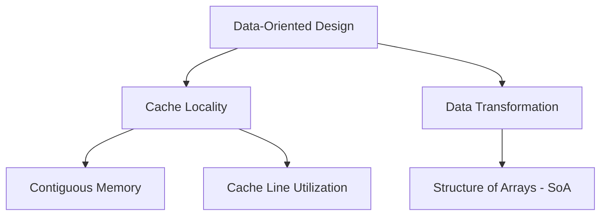

# Data-Oriented Design (DOD) Basics

Data-Oriented Design (DOD) focuses on memory layout and CPU access patterns to maximize performance, prioritizing data transformations over object-based abstraction.

## Core Concepts

### The Memory Bottleneck
Modern performance is gated by RAM access speed rather than CPU instruction speed.

- **Cache Line**: Data is fetched in 64-byte chunks.
- **Cache Miss**: Occurs when required data is not in L1/L2/L3, causing CPU stalls.
- **Optimization Strategy**: Store related data contiguously to ensure prefetching loads subsequent data into the cache line.

## Architecture: OOP vs. DOD

| Feature | Object-Oriented (OOP) | Data-Oriented (DOD) |
| :--- | :--- | :--- |
| **Organization** | Objects (Behavior + Data) | Data Transformations |
| **Memory** | Array of Structures (AoS) | Structure of Arrays (SoA) |
| **Efficiency** | Lower (Cache waste) | Higher (Perfect locality) |

## Entity Component System (ECS)

The standard architectural pattern for DOD.

- **Entities**: Unique IDs.
- **Components**: Pure data stored in arrays.
- **Systems**: Logic functions iterating over component arrays.

### Advanced Optimization: Archetypes
[[Archetypes]] group entities with identical component sets, enabling linear memory iteration and maximizing CPU prefetching.

---
**References**: See [[Model Context Protocol (MCP)]] for data interchange patterns if applicable.
