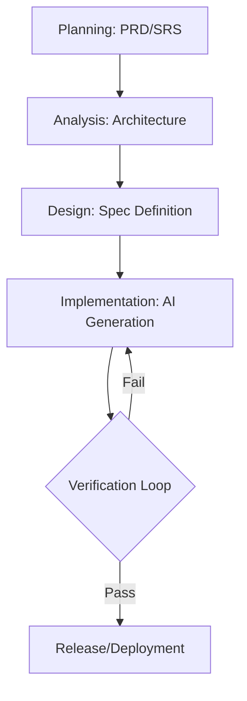

# SDLC Pipeline in Vibe Coding

[[Vibe Coding]]의 한계를 극복하기 위한 SDLC 단계별 자동화 체계 및 [[Spec Driven Development]] 기반 프레임워크를 기술한다.

## 1. SDLC 재구성 및 단계별 원칙
| 단계 | 핵심 작업 | AI/에이전트 역할 |
| :--- | :--- | :--- |
| **Planning** | 요구사항 명세(PRD/SRS) | Feasibility 분석 및 자원 최적화 |
| **Analysis** | 모델링 및 아키텍처 설계 | 도메인 엔티티 정의, 상호작용 설계 |
| **Design** | 구현 명세 (Interface/Spec) | 구체적 동작 설계 및 테스트 케이스 정의 |
| **Implementation** | 자동화된 코딩 및 테스트 | 에이전트 기반 생성 및 검증(CI/CD) |

## 2. SDLC 파이프라인 워크플로우

## 3. Agentic Coding으로의 전환 (패턴)
* **Single Agent**: 단일 단순 작업.
* **Sequential Agent**: SDLC 단계별 순차 처리에 최적 (예: 분석 → 설계 → 구현).
* **Parallel Agent**: Research/디자인 단계에서 독립적 모듈 동시 처리.

## 4. 참조 링크
* [[Vibe Coding and Agent Coding]]
* [[Spec Driven Development]]
* [[Agentic Coding]]

---
**Source**: `raw/2. SDLC pipeline in Vibe coding.pdf`
**Compiled by**: Knowledge Architect
**Date**: 2026-05-20

