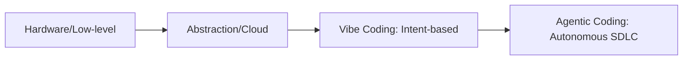

# Vibe Coding and Agentic Coding

[[Vibe Coding]]에서 [[Agentic Coding]]으로의 소프트웨어 엔지니어링 패러다임 전환을 기술한다.

## 1. 패러다임 비교
| 구분 | Vibe Coding (2024~) | Agentic Coding (2025~) |
| :--- | :--- | :--- |
| **핵심 기제** | 직관적 자연어 프롬프트 | 자율 에이전트 기반 SDLC 자동화 |
| **개발 방식** | Accept-All 방식 (즉각 실행) | Spec-Driven, 검증 기반 실행 |
| **기술 부채** | 관리 부족으로 인한 급증 위험 | 에이전트 검증 루프를 통한 제어 |
| **개발자 역할** | 창의적 제안자 | 아키텍트, 검증자, Orchestrator |

## 2. 진화 흐름

## 3. 핵심 아키텍처 원칙
* **Goal-Driven**: 모든 코드 생성은 명확한 목표 지향.
* **Verification-Loop**: [[SDLC Pipeline in Vibe Coding]]을 통해 매 단계 검증 수행.
* **Component-Interaction**: 시스템 구성 요소 간의 상호작용 규칙 설계 우선.

## 4. 참조 링크
* [[Agentic Coding]]
* [[SDLC Pipeline in Vibe Coding]]
* [[Spec Driven Development]]

---
**Source**: `raw/vibe_coding.pdf`
**Compiled by**: Knowledge Architect
**Date**: 2026-05-20

