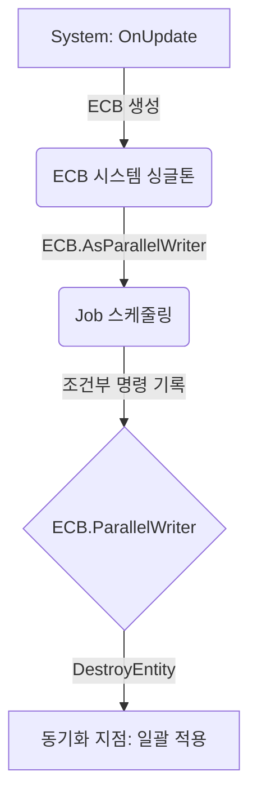

# Unity ECS Entity Command Buffer (ECB)

## 1. 개요
* **정의:** Unity ECS 환경에서 구조적 변경(엔티티 생성/파괴, 컴포넌트 추가/제거)을 안전하게 수행하기 위한 명령 기록(Recording) 시스템.
* **핵심 목적:** 멀티스레드 환경(Job System)에서 메모리 재배치를 유발하는 작업의 경합 방지 및 데이터 무결성 보장.

## 2. 핵심 동작 원리
* **구조적 변경 정의:** 메모리 청크(Chunk) 재배치를 유발하는 작업. 작업 도중 실시간 데이터 레이아웃 변경은 금지됨.

### 처리 절차
| 단계 | 설명 | 실행 위치 |
| :--- | :--- | :--- |
| **1. 기록 (Record)** | 명령을 ECB 대기열에 기록 (실제 변경 X) | Job 내부 |
| **2. 재생 (Playback)** | 쌓인 명령을 메모리에 일괄 적용 | 메인 스레드/Sync Point |
| **3. 폐기 (Dispose)** | 임시 메모리 해제 | 자동 (시스템 관리 하) |

## 3. 사용 이점 및 환경
* **Job System 대응:** 시스템 로직(예: `IJobEntity`) 내에서 엔티티 생성 및 파괴 작업 수행 가능.
* **성능 최적화:** 산발적인 구조적 변경을 ECB로 모아 단일 동기화 지점에서 일괄 처리(Batching)함으로써 파이프라인 병목(Stall) 최소화.

## 4. 구현 가이드

### 사용 패턴
1. **싱글톤 접근:** `SystemAPI`를 통해 `EntityCommandBufferSystem` 및 ECB 생성.
2. **병렬 기록:** 멀티스레드 환경에서는 `EntityCommandBuffer.ParallelWriter` 활용.
3. **순서 보장:** `[ChunkIndexInQuery]`를 통해 병렬 환경 내 기록 순서 보장.

### 코드 예제 요약

**[구현 로직]**
* **시스템 단계:** ECB 생성 및 Job 스케줄링.
* **Job 단계:** `ParallelWriter`를 통해 조건부 엔티티 파괴 명령 기록 수행.